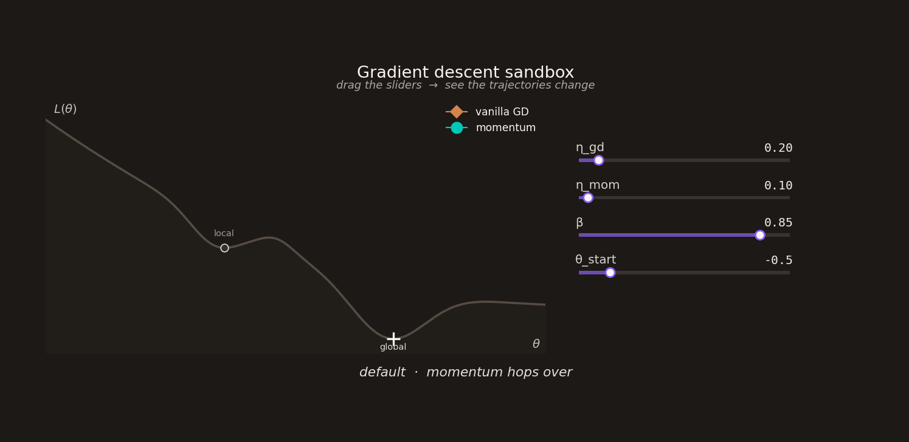

# Gradient descent sandbox

[](https://colab.research.google.com/github/ci-ber/sgd_demo/blob/main/gradient_descent_demo.ipynb)
[](https://opensource.org/licenses/MIT)

A small interactive playground for learning how gradient descent and momentum behave on 1D loss surfaces. Built as a teaching companion for an introductory lecture on gradient descent.

Move the sliders, watch the trajectories. Then try the exercises.



## What's in here

A single self-contained Jupyter notebook (`gradient_descent_demo.ipynb`) with:

- **Two algorithms** — vanilla gradient descent and gradient descent with momentum, written from scratch in twelve lines total.
- **Four loss surfaces** — a convex bowl, a long shallow plateau into a well, a wiggly cosine with many local minima, and the lecture surface (a local minimum that vanilla GD gets stuck in but momentum hops over).
- **Interactive sliders** for the learning rate η, momentum β, starting point θ₀, and number of steps. Live re-runs as you drag.
- **A bonus SGD section** that adds Gaussian noise to the gradient — demonstrating how stochasticity helps escape shallow local minima.
- **Five exercises** designed for early-undergraduate students, including: verifying the theoretical η < 2/L'' divergence threshold, finding hyperparameters where momentum *also* gets stuck, tuning SGD noise on the wiggly surface, and implementing RMSprop yourself.
- **An animation export function** so you can save your favorite trajectory as a GIF or MP4.
- **A short, hand-checked further-reading section** linking to 3Blue1Brown's deep learning series, the Goodfellow textbook, Nielsen's free online book, and the canonical papers on momentum and Adam.

No hallucinated references. Every link verified.

## Quick start

The fastest way: **click the "Open in Colab" badge above**. It runs in your browser, no installation, no setup.

If you'd rather run locally:

```bash
git clone https://github.com/USERNAME/REPO.git
cd REPO
pip install numpy matplotlib ipywidgets
jupyter notebook gradient_descent_sandbox.ipynb
```

## What you'll learn

By the end of the notebook you should be able to answer, in your own words:

1. Why does the learning rate matter, and what value makes vanilla gradient descent *diverge* on a convex bowl?
2. What does momentum actually do — and where does it help vs. where does it fail?
3. Why does adding noise to the gradient (SGD) sometimes *help* optimization, contrary to what you might expect?
4. What's the difference between the optimization algorithm and the way the gradient is computed (autograd / backprop)?

The notebook is honest about what it's *not* showing too — most of the practical value of momentum in real deep learning comes from navigating ill-conditioned high-dimensional landscapes, not from escaping local minima. The 1D picture builds the right intuition for inertia and stochasticity, and the further-reading section points you toward the deeper material.

## Suggested classroom use

The notebook is designed to fit into a 15-minute lecture demo or a one-hour lab session. Suggested cuts:

- **Lecture demo (~15 min)** — sections 1–5. Show one or two slider experiments live, ask the class to predict before each change.
- **Lab session (~60 min)** — the whole notebook. Sections 6–7 (SGD + exercises) work well as group work.
- **Take-home assignment** — exercises 1–5 in section 7, plus an open-ended challenge: "design a loss surface where momentum hurts more than it helps."

## Context

This was put together as part of preparation for the W1 professorship colloquium "Machine Learning in Digital Health" at FAU Erlangen-Nürnberg. The teaching demonstration topic was *Introduction to gradient descent*, given to 3rd–4th semester Bachelor's students in Artificial Intelligence.

I'm sharing it because (a) others teaching introductory ML may find it useful, and (b) the students in the room asked for it.

## Author

Cosmin Bercea — cosmin.bercea@tum.de

## License

MIT — see [LICENSE](LICENSE).

You're free to use, modify, and redistribute, including for commercial use. Attribution appreciated but not required. If you make improvements, a pull request would be lovely.
